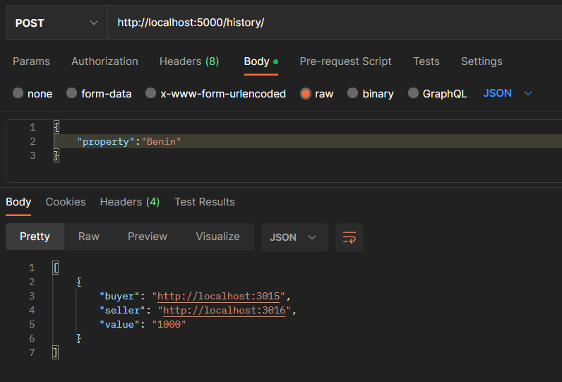

# BITS-F452-Assignment-1
Implementation of Delegated Proof of Stake(DPoS) consensus algorithm
## Team Members (Group 26)
<ol>
  <li>Deep Chordia (2020A7PS2073H) </li>
  <li>Neeraj Gunda (2020A7PS0169H) </li>
  <li>Sravika Linga (2020A7PS1310H)</li>
</ol>
 
## Objective 
This assignment focuses on implementing blockchain for maintaining land records. The consensus algorithm used is Delegated Proof of Stake(DPoS). 

<h2>Implementation</h2>
<ul>
<li>All the methods are defined in blockchain.py and the API routes in app.py</li>
<li>The DPoS consensus algorithm is defined in blockchain.py file.</li>
<li>The merkle.py consists all the functions required to produce merkle root (https://github.com/Tierion/pymerkletools)</li>
</ul>

<h3> Methods </h3>
<ul>
<li>We can add nodes to the network using the /add/user API endpoint, while adding user it is required to specify the unique property's name</li>
<li> For the voting mechanism, we are using randint function for each node and the vote(their stake) is assigned to the index generated</li>
<li> The result function sorts and gives us the 3 eligible miners</li   >
</ul>

<h3> API endpoints </h3>
localhost:5000 acts as primary node which is responisble for adding new users and election process  
<ol>
 
 <li>/add/users</li>
  This POST route allows us to add new users(nodes) to our blockchain network
  
 <li> /add/transaction</li>
  This POST route allows us to add new transactions(smallest element of a block) to our blockchain network
  
 <li>/history</li>
  This POST route shows us the entire transaction history related to a specific property
  
  <li>/chain</li>
  This GET route allows us to view the blockchain(all the blocks added to blockchain)
  
  <li>/voting</li>
  This GET route initiates the voting process, it sorts the users accoring to the votes they received(stake included) and displays the votes received. Only primary node is eligible to host election
  
  <li>/witnesses</li>
  This GET route displays the the top 3 nodes who received the maximum amount of votes, only these nodes are allowed to mine the block
  
  <li>/mine</li>
  This GET route used for mining the block, a minimum of 2 transactions are required for witnesses(delegates) to mine a block.
  
  
</ol>

<h2>Tech</h2>
<ul>
<li> This project was built using Python-Flask framework</li>
<li>Postman was used to test and interact with the endpoint</li>
</ul>
